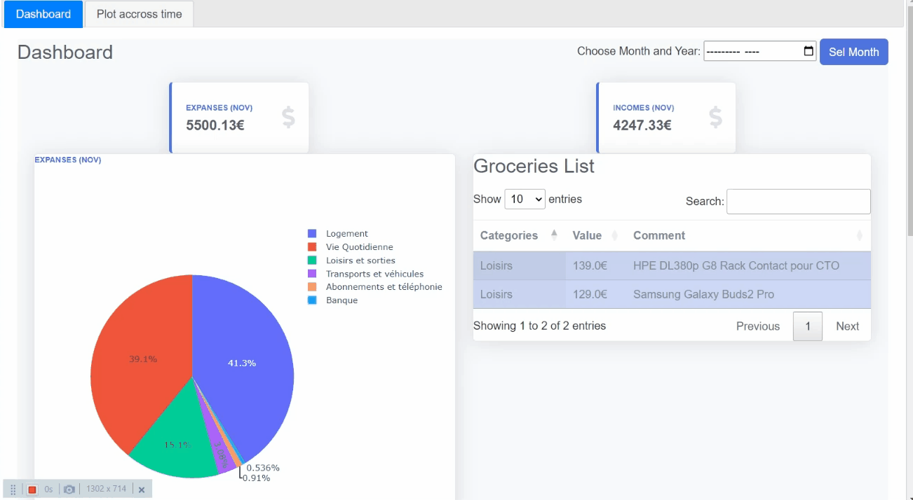
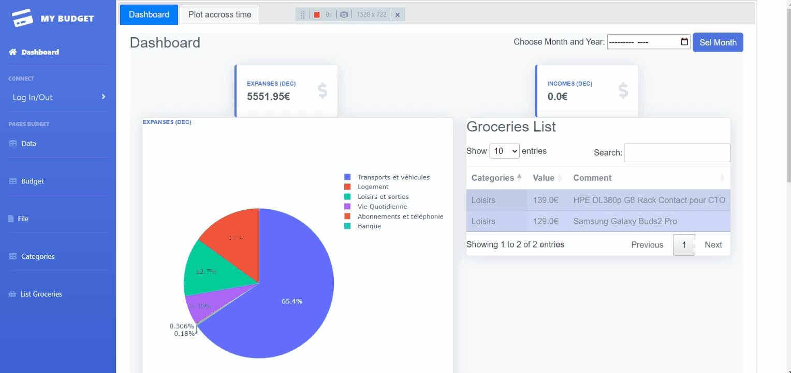
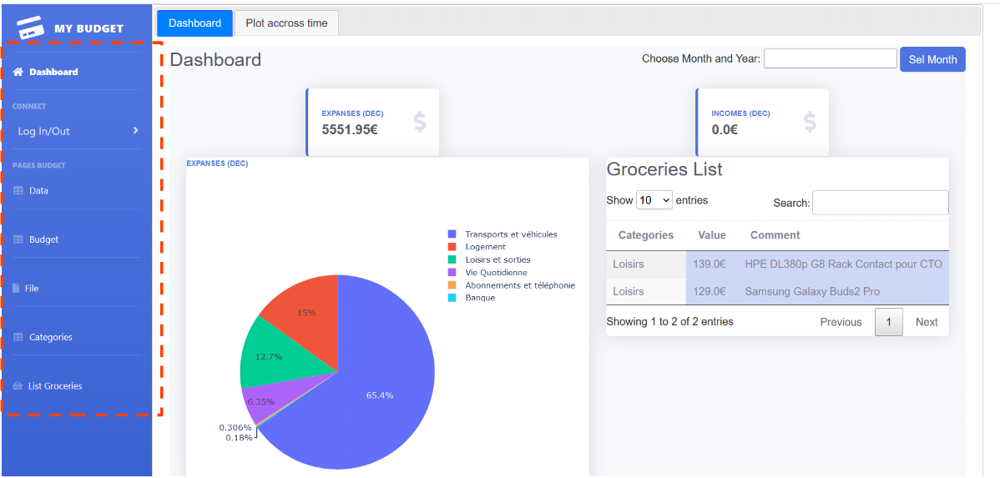
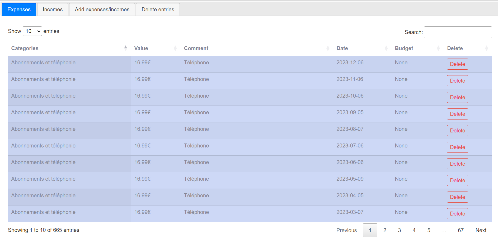
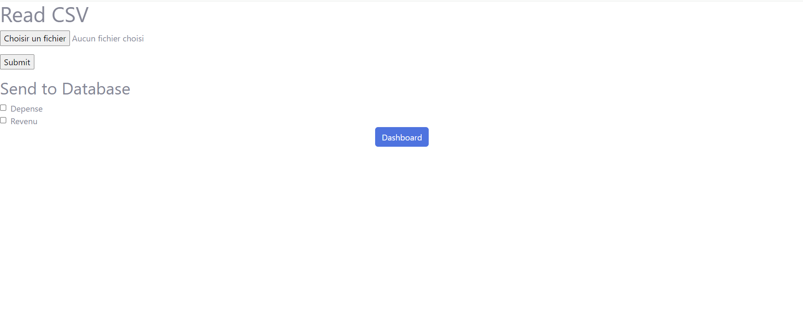

# :bar_chart: Budget App
First application Flask which I want to evolve into an application to keep an eye on my budget.\
It is mostly used for my expanses which is not easily use by another user.\
\
Firstly based on https://flask.palletsprojects.com/en/0.12.x/tutorial/introduction/

## :hammer_and_wrench: Learned

Flask: a micro web framework written in Python.\
SQL/Postgre: to stock all data\
\
CSS style: https://startbootstrap.com/theme/sb-admin-2\
JQuery to add dynamic tables\

## 	:desktop_computer: UI

The homepage is a dashboard showing the monthly expenses.\
For this example I put in plaece a set of random expanses and incomes.

### Dashboard

There is an additional tab to show a history of expenses and incomes.

### Historic

In addition, there are sevral button in the lateral frame, which point to other pages.

### Buttons

For example this page show the expanses, incomes and allow the addition of new entries.

### Expanses

This page has functionality to read in bank statements automatically, removing the need to type them up every time.

### Read File

Create a budget to associate with your expenses.

### Budget
